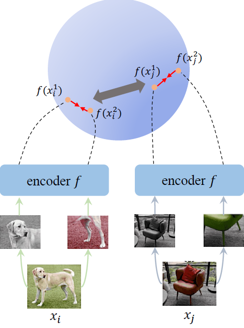
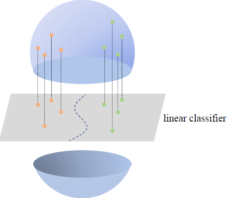
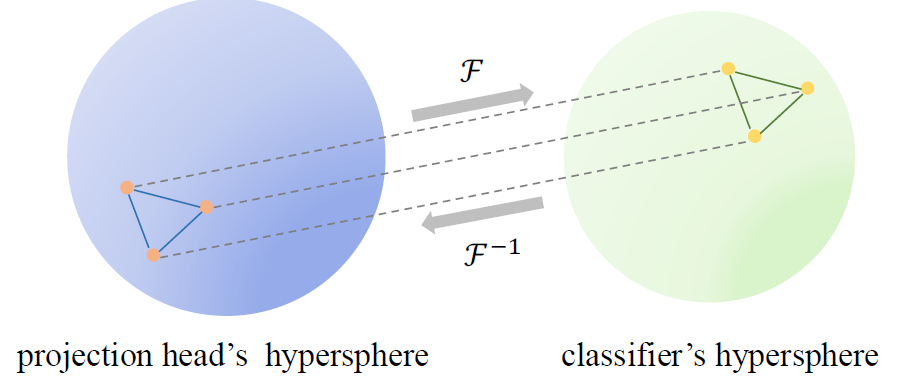

# Hyperspherical Consistency Regularization

This repository contains the implementation code for paper:

**Hyperspherical Consistency Regularization**  
[Cheng Tan](https://westlake-drug-discovery.github.io/zhangyang_gao.html), [Zhangyang Gao](http://web.mit.edu/phillipi/), [Lirong Wu](https://lirongwu.github.io/), [Siyuan Li](https://scholar.google.com/citations?user=SKTQTXwAAAAJ&hl), [Stan Z. Li](https://scholar.google.com/citations?user=Y-nyLGIAAAAJ&hl). In [CVPR](), 2022.

## Brief introduction

<p float="center">
    
    
</p>

In this work, we explore the relationship between self-supervised
learning and supervised learning, and study how self-supervised learning helps
robust data-efficient deep learning. We propose hyperspherical consistency
regularization (HCR), a simple yet effective plug-and-play method, to
regularize the classifier using feature-dependent information and thus avoid
bias from labels. Specifically, HCR first projects logits from the classifier
and feature projections from the projection head on the respective hypersphere,
then it enforces data points on hyperspheres to have similar structures by
minimizing binary cross entropy of pairwise distances' similarity metrics.

We consider the pairwise distance as the key geometry property, and force points on the classifier's hypersphere to have a similar structure as the projection head's, as follows:

<p align="center">
     <br>
</p>

## Dependencies
* torch

## Usage

The following Python code is all you need.

```python
from hcr import HCR

hcr_reg = HCR(classifier_network, lr)

for epoch in epochs:
    for batch in dataloader:
        # get logits and projections as the input of HCR
        hcr_reg.update(logits, projections)
```

## Citation

If you are interested in our repository and our paper, please cite the following paper:

```
TBD
```

## Contact

If you have any questions, feel free to contact me through email (tancheng@westlake.edu.cn). Enjoy!